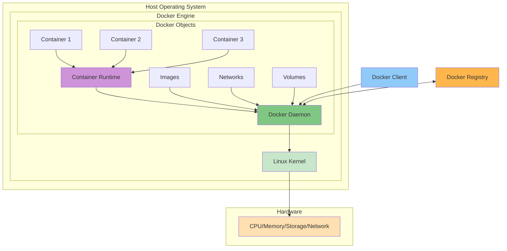

# What is Docker?

Docker is a platform for developing, shipping, and running applications in containers. Containers are lightweight, portable, and self-sufficient units that can run applications and their dependencies consistently across different computing environments.

## Docker Containers vs. Virtual Machines: Feature Comparison

| Feature            | Docker Containers                                                        | Virtual Machines                                                         |
| ------------------ | ------------------------------------------------------------------------ | ------------------------------------------------------------------------ |
| **Architecture**   | Share the host OS kernel with lightweight isolation                      | Run complete OS with dedicated virtualized kernel                        |
| **Resource Usage** | Minimal overhead, typically use less CPU/memory                          | Higher overhead with resources dedicated to each VM                      |
| **Storage Size**   | Typically 10-100MB (without application)                                 | Usually 1-20GB minimum for OS alone                                      |
| **Boot Time**      | Seconds or milliseconds                                                  | Minutes                                                                  |
| **Performance**    | Near-native performance                                                  | Slight performance penalty due to hardware virtualization                |
| **Isolation**      | Process-level isolation, somewhat less secure                            | Complete hardware-level isolation, more secure                           |
| **OS Support**     | Must use same kernel as host (Linux containers on Linux, etc.)           | Can run any OS independent of host (Windows on Linux, etc.)              |
| **Persistence**    | Ephemeral by default, data lost on container removal unless volumes used | Persistent by default, maintains state between restarts                  |
| **Image Size**     | Smaller, layered filesystem optimizes storage                            | Larger, complete OS images                                               |
| **Deployment**     | Simple, consistent deployment with Docker commands                       | More complex setup with hypervisor configurations                        |
| **Portability**    | Highly portable across any system with Docker runtime                    | Portable between compatible hypervisors                                  |
| **Scalability**    | Easily scalable, lightweight to replicate                                | Heavier to scale, more resource-intensive                                |
| **Management**     | Docker CLI, Docker Compose, Kubernetes, etc.                             | Hypervisor management tools (vCenter, Hyper-V Manager)                   |
| **Networking**     | Virtualized networking, often NAT by default                             | Full network stack virtualization with more options                      |
| **Use Cases**      | Microservices, CI/CD, development environments                           | Legacy applications, different OS requirements, stronger isolation needs |

Key aspects of Docker:

- **Containerization**: Docker packages applications and dependencies into standardized containers that can run anywhere
- **Isolation**: Each container runs in isolation from other containers and the host system
- **Portability**: Containers can run on any system that has Docker installed, regardless of the underlying infrastructure
- **Efficiency**: Containers share the host OS kernel and are more lightweight than traditional virtual machines
- **Scalability**: Easy to scale applications by running multiple containers
- **Version Control**: Container images can be versioned and rolled back if needed

Docker helps solve the "it works on my machine" problem by ensuring consistent environments from development through production.

## Benefits

- Consistent development and deployment environments
- Fast application startup and scaling
- Better resource utilization compared to VMs
- Simplified application distribution
- Easy application isolation and dependencies management
- Support for microservices architecture

## Docker Architecture

Docker uses a client-server architecture consisting of several key components:

### Docker Client

- The Docker CLI (Command Line Interface) that users interact with
- Sends commands to Docker daemon using Docker API
- Can communicate with remote Docker daemons

### Docker Daemon (dockerd)

- The server component that manages Docker objects
- Handles container lifecycle operations
- Manages images, containers, networks, and volumes
- Listens for Docker API requests
- Communicates with other daemons for Docker services

### Docker Objects

1. **Images**

   - Read-only templates for creating containers
   - Based on layered filesystem
   - Can be shared and reused
   - Stored in registries

2. **Containers**

   - Runnable/running instances of Docker images
   - Isolated from other containers and host
   - Can be started, stopped, moved, and deleted
   - Can be connected to networks
   - Can have storage attached

3. **Networks**

   - Enable communication between containers
   - Can isolate container communications
   - Multiple network drivers available

4. **Volumes**
   - Persistent data storage
   - Independent of container lifecycle
   - Can be shared between containers

### Docker Registry

- Stores Docker images
- Can be public (Docker Hub) or private
- Used for pulling and pushing images
- Enables image distribution

### Container Runtime

- Low-level component that runs containers
- Default is containerd
- Manages container lifecycle
- Interfaces with host OS kernel

The architecture enables:

- Distributed application deployment
- Scalable container operations
- Efficient resource utilization
- Secure isolation between applications



## Docker Components

Docker consists of several key components that work together to enable containerization:

### Docker CLI

- Command-line interface for Docker
- Used to interact with Docker daemon
- Executes Docker commands
- Manages Docker objects through commands
- Provides user interface for Docker operations

### Docker API

- RESTful API interface
- Enables programmatic control of Docker
- Used by Docker CLI and other tools
- Allows automation and integration
- Provides interface for remote management

### Docker Engine

- Core container runtime
- Consists of:
  - Docker daemon (dockerd)
  - containerd
  - runc
- Manages container lifecycle
- Handles container execution

### Docker Build

- Component for building Docker images
- Processes Dockerfile instructions
- Creates image layers
- Manages build cache
- Enables reproducible builds

### Docker Compose

- Tool for multi-container applications
- Defines services in YAML format
- Manages application stacks
- Handles service dependencies
- Simplifies development workflows

#### These components form an integrated platform that enables:

- Container creation and management
- Application packaging and distribution
- Multi-container orchestration
- Development and deployment automation

## Docker Ecosystem

The Docker ecosystem consists of various tools, services, and platforms that enhance Docker's capabilities:

### Container Orchestration

Container orchestration refers to the automated management, scaling, deployment, and coordination of containerized applications across a cluster of machines. It provides tools and platforms that help manage containers at scale by handling tasks such as:

- **Container Scheduling**: Automatically placing containers on appropriate hosts based on resource requirements and constraints
- **Service Discovery**: Enabling containers to find and communicate with each other
- **Load Balancing**: Distributing traffic across multiple container instances
- **Health Monitoring**: Checking container health and automatically replacing failed containers
- **Rolling Updates**: Deploying new versions of applications without downtime
- **Auto-scaling**: Automatically adding or removing container instances based on demand
- **Storage Management**: Handling persistent storage needs across containers
- **Network Management**: Managing container networking and service mesh
- **Security**: Implementing security policies and access controls

Container orchestration platforms simplify the operational complexity of running containerized applications in production environments by providing automated solutions for container lifecycle management.

- Kubernetes - Industry standard for container orchestration
- Docker Swarm - Native Docker orchestration solution
- Amazon ECS - AWS container orchestration service
- Azure Container Service - Microsoft's container platform

### Development Tools

- Docker Desktop - Local development environment
- Visual Studio Docker Tools - IDE integration
- Docker Compose - Multi-container development
- Docker Scanner - Security scanning tools

### Monitoring & Management

- Portainer - Container management UI
- Prometheus - Metrics and monitoring
- Grafana - Visualization and dashboards
- cAdvisor - Container resource usage

### Security Tools

- Docker Security Scanning
- Aqua Security
- Twistlock
- Snyk Container Security

### Registry Services

- Docker Hub - Public/private image registry
- Amazon ECR - AWS container registry
- Azure Container Registry
- Google Container Registry

### CI/CD Integration

- Jenkins with Docker
- GitLab CI/CD
- GitHub Actions
- CircleCI

This extensive ecosystem provides:

- Comprehensive container management
- Enterprise-grade security
- Scalable deployment options
- Development workflow optimization
- Production-ready monitoring

## Inside a Docker Image

- **Base Layer**:

  - Starting point of the image
  - Usually a minimal operating system (e.g., Alpine, Ubuntu)
  - Contains essential system tools and libraries

- **Application Layer**:

  - Application code and dependencies
  - Runtime environments (e.g., Node.js, Python, Java)
  - Configuration files
  - Required libraries and packages

- **Metadata**:

  - Image configuration data
  - Environment variables
  - Exposed ports
  - Volume mount points
  - Default commands and entry points

- **Layer Structure**:

  - Images are built using a layered filesystem
  - Each instruction in Dockerfile creates a new layer
  - Layers are cached and reusable
  - Only modified layers need to be rebuilt
  - Layers are read-only when running containers

- **Image Manifest**:
  - JSON file describing image contents
  - Lists all layers and their order
  - Contains image configuration
  - Includes digest (SHA256) for verification
  - Specifies platform compatibility

Benefits of layered architecture:

- Efficient storage and distribution
- Fast image building
- Layer caching and reuse
- Reduced bandwidth usage
- Optimized container deployment

## Inside a Docker Container

- **Runtime Environment**:

  - Isolated process namespace
  - Dedicated network interface
  - Virtual filesystem
  - Resource constraints (CPU, memory limits)
  - Container-specific environment variables

  - **Filesystem Layout**:

    - Read-write layer on top of image layers
    - Container-specific modifications
    - Temporary storage (deleted when container stops)
    - Mounted volumes for persistent storage
    - Bind mounts for host filesystem access

  - **Process Space**:

    - Single main process (PID 1)
    - Child processes isolated from host
    - Process signals and lifecycle management
    - Limited system privileges
    - Controlled resource access

  - **Network Stack**:

    - Virtual ethernet interface
    - Port mappings to host
    - Internal DNS resolution
    - Network namespace isolation
    - Inter-container communication

  - **Resource Controls**:
    - CPU scheduling and limits
    - Memory allocation and constraints
    - Block I/O prioritization
    - Network bandwidth controls
    - Ulimit restrictions

  Benefits of container isolation:

  - Enhanced security
  - Resource optimization
  - Process isolation
  - Predictable execution
  - Easy cleanup and disposal

## Docker Installation and Setup

### System Requirements

#### Windows Requirements

- Windows 10/11 Pro, Enterprise, or Education (64-bit)
- WSL 2 enabled
- 4GB RAM minimum (8GB recommended)
- CPU with virtualization support (Intel VT-x/AMD-V)
- BIOS-enabled virtualization

#### Mac Requirements

- macOS 10.15 or newer
- 4GB RAM minimum (8GB recommended)
- Apple Silicon (M1/M2) or Intel processor
- VirtualBox not running (conflicts with hypervisor)

#### Linux Requirements

- 64-bit kernel and CPU support for virtualization
- 3.10 or higher kernel version
- systemd init system
- 4GB RAM minimum
- Compatible storage driver support

### Configuration

1. Basic Configuration

   - Docker daemon settings: Configure core Docker daemon behavior through the daemon.json file, including default runtime, registry mirrors, and logging drivers. This file is typically located at /etc/docker/daemon.json and allows you to customize how the Docker daemon operates.

   - Network configuration: Set up Docker's networking capabilities including bridge networks, overlay networks, and port mappings. This determines how containers communicate with each other and the outside world. You can create custom networks for container isolation and specify DNS settings.

   - Storage driver selection: Choose the appropriate storage driver (overlay2, devicemapper, etc.) based on your OS and requirements. The storage driver controls how images and containers are stored and managed on disk, affecting performance and functionality.

   - Resource limits (CPU, memory): Define default resource constraints for containers to prevent resource exhaustion. This includes setting CPU shares, memory limits, and swap space to ensure containers don't overwhelm the host system.

   - Logging options: Configure logging drivers and options to determine how container logs are collected, stored and rotated. Options include json-file, syslog, journald among others, with configurable log size and retention policies.

2. Security Configuration

   - TLS encryption setup: Enable and configure Transport Layer Security (TLS) for secure communication between Docker client and daemon. This involves generating certificates, configuring the daemon to use TLS, and setting up client authentication.

   - User namespace mapping: Configure user namespace remapping to enhance container isolation by mapping container user IDs to different host IDs. This provides an additional security layer by limiting container privileges on the host.

   - Security profiles: Implement security profiles like AppArmor or SELinux to enforce access controls and container isolation. These profiles define what resources and capabilities containers can access.

   - Access controls: Set up user and group permissions, role-based access control (RBAC), and authentication mechanisms to control who can perform Docker operations. This includes managing Docker group membership and API access.

3. Registry Configuration

   - Mirror settings: Configure registry mirrors to cache and speed up image pulls from remote registries. This can significantly improve performance and reduce bandwidth usage in multi-host deployments.

   - Authentication: Set up authentication for private registries including credential helpers and login configuration. This ensures secure access to private container images and prevents unauthorized access.

   - Proxy configuration: Configure HTTP/HTTPS proxies for Docker to access registries through corporate firewalls or network restrictions. This includes setting up certificates and proxy environment variables.

   - Insecure registry handling: Configure Docker to work with registries that don't use HTTPS or have self-signed certificates. While not recommended for production, this may be needed in development environments.

4. Performance Tuning

   - Cache settings: Optimize build and layer caching to speed up image builds and reduce disk usage. This includes configuring cache drivers, pruning policies, and build-time cache settings.

   - Container limits: Fine-tune container resource limits including CPU scheduling, memory allocation, and I/O priorities. This helps ensure optimal resource utilization and prevent container interference.

   - Storage optimization: Implement storage optimization strategies including image layering, multi-stage builds, and regular cleanup of unused images and containers. This helps manage disk space and improve build performance.

   - Network performance: Optimize container networking through proper driver selection, network segmentation, and traffic control settings. This includes tuning MTU sizes, implementing load balancing, and managing network policies.

5. Integration Setup

   - Kubernetes enablement: Configure Docker to work with Kubernetes, including setting up kubeadm, enabling required plugins, and configuring container runtime interface (CRI). This allows seamless integration with Kubernetes orchestration.

   - Docker Compose installation: Set up Docker Compose for managing multi-container applications, including version selection and plugin configuration. This enables declarative application deployment and management.

   - CI/CD system configuration: Integrate Docker with CI/CD pipelines including registry authentication, build caching, and artifact management. This ensures smooth automated build and deployment processes.

   - Monitoring tool setup: Configure monitoring and logging tools like Prometheus, Grafana, or ELK stack for container visibility. This includes setting up metrics collection, log aggregation, and alerting systems.

Docker can be installed on various operating systems using different methods. Here's a comprehensive guide:

### Installation Methods

1. Install Required Dependencies

   - Update package index: `sudo apt-get update`
   - Install prerequisites:
     ```bash
     sudo apt-get install \
         ca-certificates \
         curl \
         gnupg \
         lsb-release
     ```

2. Add Docker's Official GPG Key

   ```bash
   sudo mkdir -m 0755 -p /etc/apt/keyrings
   curl -fsSL https://download.docker.com/linux/ubuntu/gpg | sudo gpg --dearmor -o /etc/apt/keyrings/docker.gpg
   ```

3. Set up Docker Repository

   ```bash
   echo \
     "deb [arch=$(dpkg --print-architecture) signed-by=/etc/apt/keyrings/docker.gpg] https://download.docker.com/linux/ubuntu \
     $(lsb_release -cs) stable" | sudo tee /etc/apt/sources.list.d/docker.list > /dev/null
   ```

4. Install Docker Engine

   ```bash
   sudo apt-get update
   sudo apt-get install docker-ce docker-ce-cli containerd.io docker-buildx-plugin docker-compose-plugin
   ```

5. Post-Installation Steps

   - Add user to docker group: `sudo usermod -aG docker $USER`
   - Verify installation: `docker --version`
   - Test with hello-world: `docker run hello-world`
   - Enable Docker service: `sudo systemctl enable docker` (for systemd, if not done already)
   - Start Docker service: `sudo systemctl start docker` (for systemd, if not done already)

6. Troubleshooting
   - Check Docker status: `sudo systemctl status docker`
   - View Docker logs: `sudo journalctl -fu docker.service`
   - Verify permissions: `groups $USER`
   - Test Docker socket access: `ls -l /var/run/docker.sock`

Each installation and configuration aspect should be carefully considered based on:

- Production vs development environment
- Security requirements
- Performance needs
- Available system resources
- Team workflow requirements

## Docker Hub and Registries

Docker Hub is Docker's official cloud-based registry service that allows you to store and distribute Docker images. Understanding registries is crucial for managing and deploying Docker containers effectively.

### Public vs Private Registries

1. Docker Hub (Public Registry)

   - Free public image hosting
   - Official images from software vendors
   - Community-contributed images
   - Basic features free, premium features subscription-based
   - Limited private repositories in free tier

2. Private Registries
   - Self-hosted options (e.g., Docker Registry, Harbor)
   - Cloud provider registries (AWS ECR, Google Container Registry, Azure Container Registry)
   - Enhanced security and access control
   - Complete control over infrastructure
   - Better network performance for internal deployments

### Image Tagging

Image tags are crucial for version management and identification:

1. Tag Format

   ```bash
   repository/image:tag
   # Example
   nginx:1.21.6
   learnwithvinod/whois:latest
   ```

2. Common Tagging Practices
   - Semantic versioning (v1.0.0)
   - Environment indicators (prod, dev, staging)
   - Build identifiers (build123, commit-sha)
   - Latest tag for most recent version

### Image Versioning

Best practices for version management:

1. Version Strategies

   - Semantic Versioning (MAJOR.MINOR.PATCH)
   - Date-based versions (YYYY-MM-DD)
   - Git commit hashes
   - Build numbers

2. Version Management
   - Always tag specific versions
   - Avoid relying solely on 'latest' tag
   - Document version changes
   - Maintain version compatibility

### Best Practices

1. Registry Management

   - Regular cleanup of unused images
   - Implement retention policies
   - Use multi-stage builds to reduce image size
   - Scan images for security vulnerabilities

2. Authentication and Security

   ```bash
   # Login to Docker Hub
   docker login

   # Login to private registry
   docker login private-registry.example.com
   ```

3. Image Pull/Push Strategy

   - Use specific tags in production
   - Implement image caching
   - Consider registry mirrors for better performance
   - Use pull secrets in Kubernetes

4. Documentation
   - Maintain clear versioning documentation
   - Document base image selections
   - Keep track of security patches
   - Document build and deployment procedures

### Basic Docker Commands

```bash
# Check Docker version
docker --version

# Display detailed version information for both client and daemon
docker version

# Show system-wide Docker information including runtime details
docker info
# Alternative command to show system information
docker system info

# Run the hello-world test container to verify Docker installation
docker run hello-world

# Run a custom whois lookup container
docker run learnwithvinod/whois

# List all running containers
docker ps

# List all containers (including stopped)
docker ps -a

# List all images
docker images
docker image ls

# Pull an image from Docker Hub
docker pull ubuntu:latest

# Create a new container without starting it
docker create [OPTIONS] IMAGE [COMMAND] [ARG...]

# Common options:
# -i          : Interactive mode
# -t          : Allocate pseudo-TTY
# -p          : Publish ports (e.g., -p 8080:80)
# -v          : Bind mount volumes
# -e          : Set environment variables
# --name      : Assign container name
# --network   : Connect to network
# --restart   : Restart policy

# Example with options
docker create --name my-ubuntu-server -it -e MY_NAME=vinod ubuntu:latest

# Start a previously created container
docker start my-ubuntu-server

# Run a container
docker run -it ubuntu:latest

# Stop a running container
docker stop <container_id>
docker stop my-ubuntu-server

# Remove a container
docker rm <container_id>
docker rm my-ubuntu-server

# Remove an image
docker rmi <image_id>
docker rmi ubuntu:latest

# View container logs
docker logs my-ubuntu-server

# Execute command in running container
docker exec -it my-ubuntu-server /bin/bash

# View detailed information about a container
docker inspect my-ubuntu-server
```

Note: Replace `<container_id>` and `<image_id>` with actual IDs from your system.
