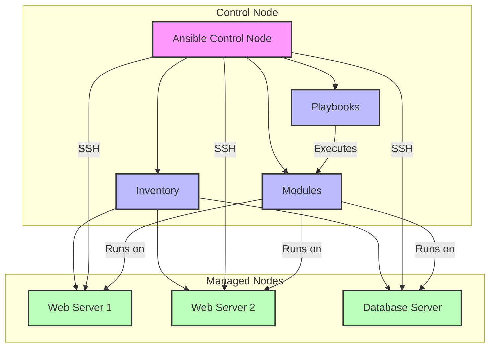

# Day 1: Introduction to Ansible

## Table of Contents

1. [Introduction to Automation and Infrastructure as Code](#introduction-to-automation-and-infrastructure-as-code)

   - [Why Automation Matters](#why-automation-matters)
   - [Overview of Configuration Management Tools](#overview-of-configuration-management-tools)
   - [Configuration Management Basics](#configuration-management-basics)

2. [Introduction to Ansible](#introduction-to-ansible)

   - [What is Ansible](#what-is-ansible)
   - [Why Ansible](#why-ansible)
   - [Ansible Architecture](#ansible-architecture)
   - [Basic Ansible Concepts](#basic-ansible-concepts)

3. [Practical Exercises](#practical-exercises)

   - [Setting up the Lab Environment](#1-setting-up-the-lab-environment)
   - [Creating and Testing Inventory](#2-creating-and-testing-inventory)
   - [Running Ansible ad hoc commands](#3-running-ansible-ad-hoc-commands)

4. [Ansible Modules](#ansible-modules)
   - [Ping Module](#1-ping-module)
   - [Command Module](#2-command-module)
   - [Debug Module](#3-debug-module)
   - [File Module](#4-file-module)
   - [Copy Module](#5-copy-module)
   - [Fetch Module](#6-fetch-module)
   - [Shell Module](#7-shell-module)
   - [APT Module](#8-apt-module)
   - [Service Module](#9-service-module)

## Introduction to Automation and Infrastructure as Code

### Why Automation Matters

In today's IT landscape, managing infrastructure manually is becoming increasingly impractical. System administrators and DevOps engineers are responsible for configuring and maintaining hundreds or even thousands of servers, which requires a consistent and efficient approach.

**Key benefits of automation:**

1. **Consistency**: Eliminates human error and ensures systems are configured identically
2. **Efficiency**: Tasks that would take hours or days manually can be accomplished in minutes
3. **Scalability**: Makes it feasible to manage large infrastructure with small teams
4. **Documentation**: Code serves as living documentation for your infrastructure
5. **Repeatability**: Processes can be reliably repeated across environments
6. **Time to Recovery**: Dramatically reduces recovery time during incidents

**Real-world example:**

Consider a scenario where you need to deploy a security patch to 500 servers. Manual approach:

- 10 minutes per server × 500 servers = 5,000 minutes (83+ hours) of work
- High risk of errors and inconsistencies
- No easy way to verify all systems were patched correctly

With automation:

- Write the automation once (30-60 minutes)
- Deploy to all 500 servers simultaneously (5-10 minutes)
- Built-in verification that all systems were patched correctly
- Reusable for future patching needs

### Overview of Configuration Management Tools

### Configuration Management Basics

#### 1. What is Configuration Management?

Configuration Management is the process of systematically handling changes to a system in a way that maintains its integrity over time. It involves:

- Tracking changes
- Maintaining consistency
- Managing system configurations
- Automating deployment

#### 2. Why Configuration Management?

- **Consistency**: Ensures all systems are configured identically
- **Scalability**: Makes it easier to manage multiple servers
- **Reliability**: Reduces human error
- **Efficiency**: Automates repetitive tasks
- **Documentation**: Provides clear system state documentation

#### 3. Popular Configuration Management Tools

Several tools exist to automate infrastructure management, each with different approaches and strengths:

| Tool          | Language    | Architecture           | Learning Curve | Key Features                                  |
| ------------- | ----------- | ---------------------- | -------------- | --------------------------------------------- |
| **Ansible**   | YAML        | Agentless, Push        | Low            | Simple syntax, no agents required, extensible |
| **Puppet**    | Ruby DSL    | Agent-based, Pull      | Moderate       | Mature, extensive modules, strong community   |
| **Chef**      | Ruby DSL    | Agent-based, Pull      | High           | Powerful, highly customizable, code-centric   |
| **SaltStack** | YAML/Python | Agent-based, Push/Pull | Moderate       | Fast, scalable, event-driven                  |
| **Terraform** | HCL         | Agentless, Push        | Moderate       | Infrastructure provisioning, state management |

**Key Characteristics:**

- **Ansible**: Agentless architecture using SSH, YAML-based syntax, easy to learn
- **Puppet**: Client-server architecture, custom DSL, more complex setup
- **Chef**: Ruby-based with client-server architecture, steeper learning curve
- **SaltStack**: Python-based with fast execution but complex for beginners
- **Terraform**: Infrastructure provisioning focused using HCL

**Abbreviations:**

- YAML: YAML Ain't Markup Language
- DSL: Domain Specific Language
- HCL: HashiCorp Configuration Language

**Infrastructure as Code (IaC)** refers to managing and provisioning infrastructure through code instead of manual processes. This paradigm shift allows teams to:

- Version control their infrastructure
- Collaborate using software development practices
- Test infrastructure changes before deployment
- Rapidly provision new environments
- Maintain consistency across development, testing, and production

### Introduction to Ansible

#### 1. What is Ansible?

Ansible is an open-source automation tool that:

- Automates configuration management
- Handles application deployment
- Manages infrastructure
- Orchestrates complex workflows

#### 2. Why Ansible?

- **Agentless**: No software needed on managed nodes
- **Simple**: Uses YAML (human-readable)
- **Powerful**: Can handle complex tasks
- **Secure**: Uses SSH for communication
- **Extensible**: Large collection of modules

#### 3. Ansible Architecture

1. **Control Node**

   - Where Ansible is installed
   - Manages the automation
   - Runs playbooks

2. **Managed Nodes**

   - Target systems
   - No Ansible installation needed
   - Accessed via SSH

3. **Inventory**

   - List of managed nodes
   - Can be static or dynamic
   - Groups hosts logically

4. **Modules**

   - Units of code Ansible executes
   - Can be written in any language
   - Return JSON

5. **Playbooks**
   - YAML files
   - Define automation tasks
   - Can include multiple plays



### Basic Ansible Concepts

#### 1. Control Node vs Managed Nodes

- **Control Node Requirements**

  ```bash
  # Required packages
  python3
  openssh
  ansible
  ```

- **Managed Node Requirements**

  ```bash
  # Only needs
  python3
  openssh
  ```

#### 2. Inventory

- **Static Inventory Example**

  ```ini
  # inventory.ini
  [webservers]
  web1 ansible_host=192.168.1.10
  web2 ansible_host=192.168.1.11

  [dbservers]
  db1 ansible_host=192.168.1.20

  [all:vars]
  ansible_user=admin
  ```

- **Dynamic Inventory**
  - Can be generated from cloud providers
  - Supports various sources (AWS, Azure, etc.)
  - Uses scripts or plugins

#### 3. Modules

- **Common Module Types**

  - System modules (package, service, file)
  - Cloud modules (AWS, Azure, GCP)
  - Database modules (mysql, postgresql)
  - Network modules (ios, junos)

- **Module Usage**

  ```bash
  # Ad-hoc command
  ansible all -m ping
  # 'ping' is the module being used here

  # With parameters
  ansible webservers -m apt -a "name=nginx state=present"
  # 'apt' is the module being used
  ```

#### 4. Playbooks

- **Basic Structure**

  ```yaml
  --- # Marks the start of YAML document
  - name: My first playbook # Descriptive name for the playbook
    hosts: webservers # Target hosts/group from inventory
    become: yes # Elevate privileges (like sudo)
    tasks: # List of tasks to execute
      - name: Install nginx # Description of this specific task
        apt: # Module name (apt package manager)
          name: nginx # Package to install
          state: present # Desired state (installed)
  ```

  This playbook:

  - Uses YAML format (marked by ---)
  - Targets servers in the 'webservers' group
  - Runs with elevated privileges
  - Contains one task that installs nginx
  - Uses the apt module to ensure nginx is installed

#### 5. Tasks

- **Task Components**
  - Name (description)
  - Module to use
  - Module parameters
  - Conditionals (optional)
  - Loops (optional)

#### 6. Handlers

- **Purpose**

  - Respond to changes
  - Run only when notified
  - Usually restart services

- **Example**

  ```yaml
  tasks:
    - name: Install nginx
      apt:
        name: nginx
        state: present
      notify: restart nginx

  handlers:
    - name: restart nginx
      service:
        name: nginx
        state: restarted
  ```

### Practical Exercises

#### 1. Setting up the Lab Environment

```bash
# Install Ansible
sudo apt update
sudo apt install ansible

# Verify installation
ansible --version
```

#### 2. Creating and Testing Inventory

```bash
# ansible-docker-lab/lab-01/inventory.ini
[web_servers]
web_server1 ansible_host=172.20.0.2 ansible_ssh_private_key_file=../ssh/ansible_rsa ansible_user=ansible
web_server2 ansible_host=172.20.0.3 ansible_ssh_private_key_file=../ssh/ansible_rsa ansible_user=ansible

[db_servers]
db_server1 ansible_host=172.20.0.4 ansible_ssh_private_key_file=../ssh/ansible_rsa ansible_user=ansible

```

#### 3. Running Ansible ad hoc commands

**Important Notes for Ad-hoc Commands:**

1. `-i inventory.ini`: Specifies the inventory file
2. `-m module`: Specifies the module to use
3. `-a "arguments"`: Provides arguments to the module
4. `-b` or `--become`: Enables privilege escalation (sudo)
5. `-v`: Increases verbosity (can be used multiple times: -vvv)
6. `--check`: Dry run mode (doesn't make changes)
7. `--diff`: Shows differences when files are changed

**Best Practices:**

1. Always use `--check` first to verify changes
2. Use `-v` for debugging
3. Group related commands in playbooks
4. Use proper privilege escalation
5. Test on a small subset of hosts first

### 1. Ping Module

The `ping` module is one of the simplest Ansible modules that verifies if your target hosts are responsive and can be managed by Ansible. It's not an ICMP ping - instead, it:

1. Connects to the target host via SSH
2. Verifies Python is installed
3. Tests basic connectivity and authentication

#### Ad-hoc Command Examples:

To ping all servers:

```bash
ansible all -i inventory.ini -m ping
```

To ping only web servers:

```bash
ansible web_servers -i inventory.ini -m ping
```

To ping only database servers:

```bash
ansible db_servers -i inventory.ini -m ping
```

To ping a specific host:

```bash
ansible 172.20.0.2 -i inventory.ini -m ping
```

#### Expected Output:

```
172.20.0.2 | SUCCESS => {
    "changed": false,
    "ping": "pong"
}
```

Command breakdown:

- `ansible`: The base command
- `web_servers/db_servers/all`: The target group from inventory
- `-i inventory.ini`: Specifies the inventory file
- `-m ping`: Specifies the module to use (ping in this case)

This is a great way to verify your Ansible setup and connectivity to your hosts before running more complex playbooks.

### 2. Command Module

The `command` module is one of the most basic modules in Ansible. It executes a command on a remote node without going through the shell. This is the default module if no other module is specified in an ad-hoc command.

Key characteristics:

- Does not support shell variables, pipes, or redirection
- More secure than shell module as it doesn't invoke the shell
- Cannot use operators like `|`, `>`, `<`, `&`
- Cannot use shell environment variables like `$HOME`

#### Ad-hoc Command Examples:

To check disk space on all servers:

```bash
ansible all -i inventory.ini -m command -a "df -h"
```

To see system uptime on web servers:

```bash
ansible web_servers -i inventory.ini -m command -a "uptime"
```

To check memory usage on database servers:

```bash
ansible db_servers -i inventory.ini -m command -a "free -m"
```

To see the current date on a specific host:

```bash
ansible 172.20.0.2 -i inventory.ini -m command -a "date"
```

#### Expected Output Example:

```
172.20.0.2 | SUCCESS | rc=0 >>
              total        used        free      shared  buff/cache   available
Mem:           7822        1458        4579         388        1784        5724
Swap:          2047           0        2047
```

Command breakdown:

- `ansible`: The base command
- `target`: Specify hosts/groups from inventory
- `-m command`: Specifies the command module (optional as it's the default)
- `-a "command"`: The actual command to run in quotes

Important Notes:

1. Use the `shell` module instead if you need shell features like pipes or environment variables
2. The command module is more secure for simple commands
3. Commands run from the current working directory on the target host
4. The command module is idempotent only if the command itself is idempotent

### 3. Debug Module

The `debug` module is used to print statements during execution and can be helpful for debugging variables or expressions. It's particularly useful when troubleshooting playbooks or displaying the value of variables.

Key characteristics:

- Prints messages directly to STDOUT
- Can display variable values
- Supports verbose mode
- Can evaluate expressions
- Useful for debugging and troubleshooting

#### Ad-hoc Command Examples:

To print a simple message to all servers:

```bash
ansible all -i inventory.ini -m debug -a "msg='Hello from Ansible Debug Module'"
```

To display the hostname of web servers:

```bash
ansible web_servers -i inventory.ini -m debug -a "var=inventory_hostname"
```

To show ansible facts of database servers:

```bash
ansible db_servers -i inventory.ini -m debug -a "var=ansible_facts"
```

To evaluate an expression on a specific host:

```bash
ansible 172.20.0.2 -i inventory.ini -m debug -a "msg={{ groups['web_servers'] }}"
```

#### Expected Output Examples:

Simple message output:

```
172.20.0.2 | SUCCESS => {
    "msg": "Hello from Ansible Debug Module"
}
172.20.0.3 | SUCCESS => {
    "msg": "Hello from Ansible Debug Module"
}
172.20.0.4 | SUCCESS => {
    "msg": "Hello from Ansible Debug Module"
}
```

Variable output:

```
172.20.0.2 | SUCCESS => {
    "inventory_hostname": "172.20.0.2"
}
172.20.0.3 | SUCCESS => {
    "inventory_hostname": "172.20.0.3"
}
```

Expression evaluation:

```
172.20.0.2 | SUCCESS => {
    "msg": ["172.20.0.2", "172.20.0.3"]
}
```

Command breakdown:

- `ansible`: The base command
- `-m debug`: Specifies the debug module
- `-a "msg='text'"`: Prints a message
- `-a "var=variable_name"`: Displays variable content
- `-a "msg={{ expression }}"`: Evaluates and displays an expression

Important Notes:

1. Debug module is mainly used in playbooks rather than ad-hoc commands
2. Very useful for troubleshooting variable values during playbook execution
3. Can be used with verbosity levels (v, vv, vvv)
4. No changes are made to the target system - it's purely for output

### 4. File Module

The `file` module is used to manage files and their properties on remote hosts. It can create, modify, delete files, directories, and symlinks, as well as manage their permissions and ownership.

Key characteristics:

- Can create, modify, or remove files/directories/symlinks
- Manages file permissions and ownership
- Can recursively set attributes
- Idempotent operations
- Supports check mode

#### Ad-hoc Command Examples:

To create a directory on web servers:

```bash
ansible web_servers -i inventory.ini -m file -a "path=/opt/app_logs state=directory mode=0755"
```

To create a file with specific permissions on database servers:

```bash
ansible db_servers -i inventory.ini -m file -a "path=/etc/app.conf state=touch mode=0644 owner=ansible group=ansible"
```

To remove a file from a specific host:

```bash
ansible 172.20.0.2 -i inventory.ini -m file -a "path=/tmp/test.txt state=absent"
```

To create a symlink on all servers:

```bash
ansible all -i inventory.ini -m file -a "src=/opt/app path=/opt/current state=link"
```

#### Expected Output Examples:

Creating directory:

```
172.20.0.2 | SUCCESS => {
    "changed": true,
    "gid": 1000,
    "group": "ansible",
    "mode": "0755",
    "owner": "ansible",
    "path": "/opt/app_logs",
    "size": 4096,
    "state": "directory",
    "uid": 1000
}
```

Removing file:

```
172.20.0.2 | SUCCESS => {
    "changed": true,
    "path": "/tmp/test.txt",
    "state": "absent"
}
```

Command breakdown:

- `ansible`: The base command
- `-m file`: Specifies the file module
- `-a "path=..."`: Specifies the file path
- `state=`: Defines desired state (directory/file/link/absent/touch)
- `mode=`: Sets permissions (octal)
- `owner=`: Sets file owner
- `group=`: Sets file group

Important Notes:

1. Common state parameters:

   - `directory`: Create directory
   - `file`: Regular file
   - `link`: Symbolic link
   - `absent`: Remove file/directory
   - `touch`: Create empty file

2. Permissions can be set using:

   - Octal (mode=0755)
   - Symbolic (mode=u+rwx,g+rx,o+rx)

3. The module is idempotent - running it multiple times has the same effect as running it once

4. Use `force=yes` when working with symlinks to force creation

### 5. Copy Module

The `copy` module copies files from the local or remote machine to locations on remote machines. It can also set file attributes like permissions and ownership during the copy operation.

Key characteristics:

- Copies files from local to remote hosts
- Can copy remote files to different locations on the same remote host
- Supports template-like variable interpolation in source files
- Can set ownership and permissions
- Backs up existing files if requested
- Validates source file existence before copying

#### Ad-hoc Command Examples:

To copy a configuration file to web servers:

```bash
ansible web_servers -i inventory.ini -m copy -a "src=/local/path/nginx.conf dest=/etc/nginx/nginx.conf mode=0644 owner=root group=root backup=yes"
```

To copy a script to database servers with execute permissions:

```bash
ansible db_servers -i inventory.ini -m copy -a "src=./scripts/backup.sh dest=/usr/local/bin/backup.sh mode=0755"
```

To copy content directly without a source file:

```bash
ansible all -i inventory.ini -m copy -a "content='Hello World\n' dest=/tmp/hello.txt"
```

To copy a file to a specific host and validate the checksum:

```bash
ansible 172.20.0.2 -i inventory.ini -m copy -a "src=./config/app.properties dest=/opt/app/config/app.properties validate=yes"
```

#### Expected Output Examples:

Successful copy:

```
172.20.0.2 | SUCCESS => {
    "changed": true,
    "checksum": "4c4f51d4a1f0242660cfd53a73af2c9df0ce5dbb",
    "dest": "/etc/nginx/nginx.conf",
    "gid": 0,
    "group": "root",
    "md5sum": "73af2c9df0ce5dbb4c4f51d4a1f02426",
    "mode": "0644",
    "owner": "root",
    "size": 1234,
    "src": "/root/.ansible/tmp/ansible-tmp-1234567.89-123456/source",
    "state": "file",
    "uid": 0
}
```

Copy with backup:

```
172.20.0.2 | SUCCESS => {
    "backup_file": "/etc/nginx/nginx.conf.2024-04-15-20-45-32",
    "changed": true,
    "dest": "/etc/nginx/nginx.conf",
    "gid": 0,
    "group": "root",
    "mode": "0644",
    "owner": "root",
    "size": 1234
}
```

Command breakdown:

- `ansible`: The base command
- `-m copy`: Specifies the copy module
- `-a "src=..."`: Source file path (local)
- `-a "dest=..."`: Destination path (remote)
- `mode=`: Sets file permissions
- `owner=`: Sets file owner
- `group=`: Sets file group
- `backup=`: Creates backup of existing file

Important Notes:

1. Source options:

   - `src=`: Path to local file to copy
   - `content=`: Direct content to write to file
   - `remote_src=yes`: Copy from remote source

2. Common parameters:

   - `force=`: Override if different (default: yes)
   - `backup=`: Create backup if file exists
   - `validate=`: Validate file checksum
   - `directory_mode=`: Set mode for parent directories

3. SELinux considerations:

   - Module maintains SELinux context
   - Use `setype=` to set SELinux type
   - Respects existing SELinux rules

4. The operation is idempotent - files are copied only if they differ from the source

### 6. Fetch Module

The `fetch` module is used to retrieve files from remote machines to the local system. It's essentially the opposite of the copy module, allowing you to download files from remote hosts.

Key characteristics:

- Retrieves files from remote nodes to control machine
- Creates a directory structure based on the remote hostname
- Can flatten directory structure if needed
- Supports validation of source files
- Useful for backup and log collection
- Can handle large files efficiently

#### Ad-hoc Command Examples:

To fetch log files from web servers:

```bash
ansible web_servers -i inventory.ini -m fetch -a "src=/var/log/nginx/error.log dest=./logs/"
```

To fetch a configuration file from database servers with flat structure:

```bash
ansible db_servers -i inventory.ini -m fetch -a "src=/etc/mysql/my.cnf dest=./configs/ flat=yes"
```

To fetch multiple files using wildcards:

```bash
ansible all -i inventory.ini -m fetch -a "src=/var/log/app/*.log dest=./logs/"
```

To fetch a file from a specific host and validate:

```bash
ansible 172.20.0.2 -i inventory.ini -m fetch -a "src=/etc/hostname dest=./hostnames/ validate=yes"
```

#### Expected Output Examples:

Successful fetch:

```
172.20.0.2 | SUCCESS => {
    "changed": true,
    "checksum": "f8c137f54aa5841e34e7d4d0d56d0ee4",
    "dest": "./logs/172.20.0.2/var/log/nginx/error.log",
    "md5sum": "f8c137f54aa5841e34e7d4d0d56d0ee4",
    "remote_checksum": "f8c137f54aa5841e34e7d4d0d56d0ee4",
    "remote_md5sum": null
}
```

Fetch with flat structure:

```
172.20.0.4 | SUCCESS => {
    "changed": true,
    "checksum": "2d8a786f74c1dc91726c41d23dd1a355",
    "dest": "./configs/my.cnf",
    "md5sum": "2d8a786f74c1dc91726c41d23dd1a355",
    "remote_checksum": "2d8a786f74c1dc91726c41d23dd1a355",
    "remote_md5sum": null
}
```

Command breakdown:

- `ansible`: The base command
- `-m fetch`: Specifies the fetch module
- `-a "src=..."`: Source file path on remote host
- `-a "dest=..."`: Destination directory on control node
- `flat=`: Whether to flatten directory structure
- `validate=`: Validate file checksum

Important Notes:

1. Directory structure:

   - By default, creates full path structure under hostname
   - Use `flat=yes` for simpler directory structure
   - Maintains source file organization

2. Common parameters:

   - `src=`: Remote file location
   - `dest=`: Local destination directory
   - `flat=`: Flatten directory structure
   - `validate=`: Verify file integrity

3. Limitations:

   - Cannot fetch directories (only files)
   - May require sufficient disk space locally
   - Network bandwidth considerations for large files

4. Best practices:
   - Use for collecting logs and configurations
   - Consider disk space on control node
   - Use wildcards carefully with large file sets
   - Implement proper error handling

### 7. Shell Module

The `shell` module executes commands using the target host's shell (usually /bin/sh). Unlike the command module, it supports shell operations like pipes, redirections, and environment variables.

Key characteristics:

- Executes commands through the shell
- Supports shell features (pipes, redirections, etc.)
- Can use environment variables
- Less secure than command module
- Allows shell operators (`|`, `>`, `<`, `&`, etc.)
- Can execute shell scripts

#### Ad-hoc Command Examples:

To find all log files larger than 100MB on web servers:

```bash
ansible web_servers -i inventory.ini -m shell -a "find /var/log -type f -size +100M | sort -n"
```

To check disk usage and save to a file on database servers:

```bash
ansible db_servers -i inventory.ini -m shell -a "df -h > /tmp/disk_usage.txt"
```

To execute a command using environment variables:

```bash
ansible all -i inventory.ini -m shell -a "echo $HOSTNAME && export APP_ENV=prod && echo $APP_ENV"
```

To run a complex pipeline on a specific host:

```bash
ansible 172.20.0.2 -i inventory.ini -m shell -a "ps aux | grep nginx | grep -v grep | awk '{print $2}'"
```

#### Expected Output Examples:

Command with pipe output:

```
172.20.0.2 | SUCCESS | rc=0 >>
/var/log/syslog.1 125M
/var/log/apache2/access.log 242M
/var/log/mysql/slow-query.log 168M
```

Environment variable usage:

```
172.20.0.2 | SUCCESS | rc=0 >>
webserver-01
prod
```

Command breakdown:

- `ansible`: The base command
- `-m shell`: Specifies the shell module
- `-a "command"`: The shell command to execute
- Supports shell operators:
  - `|`: Pipe output between commands
  - `>`, `>>`: Redirect output
  - `$VAR`: Environment variables
  - `&&`, `||`: Command chaining

Important Notes:

1. Security considerations:

   - More vulnerable to command injection
   - Use command module when possible
   - Avoid using with untrusted input
   - Be cautious with user-provided variables

2. Common use cases:

   - Complex command pipelines
   - Scripts requiring shell features
   - Commands using environment variables
   - Output redirection
   - Background processes

3. Working directory:

   - Commands execute in user's home directory by default
   - Use `chdir` parameter to change working directory
   - Example: `chdir=/path/to/dir command`

4. Error handling:
   - Use `creates` to prevent rerunning successful commands
   - Use `removes` for idempotency with cleanup tasks
   - Check return codes for error detection

### 8. APT Module

The `apt` module manages packages on Debian-based systems (Ubuntu, Debian, etc.). It handles package installation, removal, updates, and repository management.

Key characteristics:

- Manages apt packages and repositories
- Supports package state management
- Can update package cache
- Handles package dependencies
- Supports version specification
- Can autoremove unused packages

#### Ad-hoc Command Examples:

To install nginx on web servers:

```bash
ansible web_servers -i inventory.ini -m apt -a "name=nginx state=present"
```

To remove mysql from database servers:

```bash
ansible db_servers -i inventory.ini -m apt -a "name=mysql-server state=absent purge=yes"
```

To update package cache and upgrade all packages:

```bash
ansible all -i inventory.ini -m apt -a "update_cache=yes upgrade=yes"
```

To install multiple packages on a specific host:

```bash
ansible 172.20.0.2 -i inventory.ini -m apt -a "name='nginx,php-fpm,curl' state=latest"
```

#### Expected Output Examples:

Successful installation:

```
172.20.0.2 | SUCCESS => {
    "changed": true,
    "stderr": "",
    "stderr_lines": [],
    "stdout": "Reading package lists...\nBuilding dependency tree...\nReading state information...\nThe following NEW packages will be installed:\n  nginx nginx-common nginx-core\n0 upgraded, 3 newly installed, 0 to remove and 0 not upgraded.\n",
    "stdout_lines": [
        "Reading package lists...",
        "Building dependency tree...",
        "Reading state information...",
        "The following NEW packages will be installed:",
        "  nginx nginx-common nginx-core",
        "0 upgraded, 3 newly installed, 0 to remove and 0 not upgraded."
    ]
}
```

Package removal:

```
172.20.0.4 | SUCCESS => {
    "changed": true,
    "stderr": "",
    "stderr_lines": [],
    "stdout": "Reading package lists...\nBuilding dependency tree...\nReading state information...\nThe following packages will be REMOVED:\n  mysql-server*\n0 upgraded, 0 newly installed, 1 to remove and 0 not upgraded.\n",
    "stdout_lines": [
        "Reading package lists...",
        "Building dependency tree...",
        "Reading state information...",
        "The following packages will be REMOVED:",
        "  mysql-server*",
        "0 upgraded, 0 newly installed, 1 to remove and 0 not upgraded."
    ]
}
```

Command breakdown:

- `ansible`: The base command
- `-m apt`: Specifies the apt module
- `-a "name=..."`: Package name(s) to manage
- `state=`: Desired package state
- `update_cache=`: Whether to run apt-get update
- `purge=`: Remove package and configuration

Important Notes:

1. Common states:

   - `present`: Ensure package is installed
   - `absent`: Ensure package is removed
   - `latest`: Install or upgrade to latest version
   - `build-dep`: Install build dependencies

2. Useful parameters:

   - `force=`: Force package installation
   - `allow_unauthenticated=`: Allow unsigned packages
   - `autoremove=`: Remove unused dependencies
   - `install_recommends=`: Install recommended packages

3. Best practices:

   - Always update cache before installing packages
   - Use specific versions when needed
   - Consider using `force_apt_get=yes` for consistent behavior
   - Handle errors appropriately

4. Performance considerations:
   - Cache updates can be time-consuming
   - Consider batching package installations
   - Use `cache_valid_time` to avoid frequent updates
   - Be cautious with `upgrade=yes` on production systems

### 9. Service Module

The `service` module controls services on remote hosts. It can manage system services (start, stop, restart) and their boot time behavior across different init systems (systemd, init.d, etc.).

Key characteristics:

- Manages system services
- Supports different init systems
- Can enable/disable services at boot
- Handles service status checks
- Works with systemd, init.d, rc.d
- Idempotent operations

#### Ad-hoc Command Examples:

To start nginx on web servers:

```bash
ansible web_servers -i inventory.ini -m service -a "name=nginx state=started"
```

To restart mysql on database servers:

```bash
ansible db_servers -i inventory.ini -m service -a "name=mysql state=restarted"
```

To enable and start a service on all servers:

```bash
ansible all -i inventory.ini -m service -a "name=ssh enabled=yes state=started"
```

To stop a service on a specific host:

```bash
ansible 172.20.0.2 -i inventory.ini -m service -a "name=apache2 state=stopped"
```

#### Expected Output Examples:

Starting service:

```
172.20.0.2 | SUCCESS => {
    "changed": true,
    "name": "nginx",
    "state": "started",
    "status": {
        "ActiveState": "active",
        "SubState": "running",
        "LoadState": "loaded",
        "UnitFileState": "enabled"
    }
}
```

Restarting service:

```
172.20.0.4 | SUCCESS => {
    "changed": true,
    "name": "mysql",
    "state": "restarted",
    "status": {
        "ActiveState": "active",
        "SubState": "running",
        "LoadState": "loaded",
        "UnitFileState": "enabled"
    }
}
```

Command breakdown:

- `ansible`: The base command
- `-m service`: Specifies the service module
- `-a "name=..."`: Service name to manage
- `state=`: Desired service state
- `enabled=`: Boot time behavior
- `daemon_reload=`: Reload systemd configuration

Important Notes:

1. Common states:

   - `started`: Ensure service is running
   - `stopped`: Ensure service is stopped
   - `restarted`: Restart the service
   - `reloaded`: Reload service configuration

2. Useful parameters:

   - `enabled=`: Start on boot (yes/no)
   - `daemon_reload=`: Reload systemd (yes/no)
   - `pattern=`: Pattern to match in process table
   - `sleep=`: Wait time between operations

3. Best practices:

   - Always verify service exists before managing
   - Use handlers in playbooks for service restarts
   - Consider dependencies when managing services
   - Handle service failures appropriately

4. Init system considerations:
   - Works with systemd by default
   - Supports SysV init scripts
   - Can use `use=` parameter to force init system
   - Different behavior across distributions
