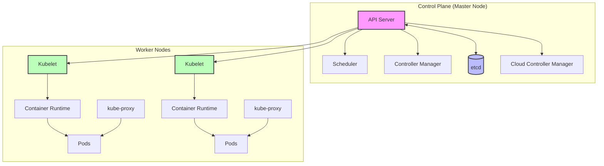

# Kubernetes Fundamentals - Day 1

## Introduction to Containers and Container Orchestration

### What are Containers?

Containers are lightweight, standalone packages that include everything needed to run a piece of software, including the code, runtime, system tools, libraries, and settings. Think of them as standardized units of software that can run anywhere.

#### Example: Container vs Traditional Deployment

```bash
# Traditional deployment
- Install Node.js
- Install dependencies
- Configure environment
- Run application

# Container deployment
docker run -d -p 3000:3000 my-node-app
```

## Understanding Microservices Architecture

### What are Microservices?

Microservices is an architectural style that structures an application as a collection of small, independent services that communicate over well-defined APIs.

### Key Characteristics of Microservices

1. **Decentralized Data Management**

   - Each service manages its own database
   - Allows for different data storage technologies per service
   - Ensures data independence and reduces coupling

2. **Built Around Business Capabilities**

   - Services are organized around business domains
   - Teams can be structured around services
   - Promotes business-technology alignment

3. **Smart Endpoints and Dumb Pipes**

   - Services communicate through simple protocols (HTTP/REST)
   - Complex logic resides in the services, not the communication layer
   - Enables loose coupling between services

4. **Design for Failure**
   - Services must handle failures gracefully
   - Implement circuit breakers and fallbacks
   - Design with resilience in mind

### Microservices vs Monolithic Architecture

#### Key Differences Between Monolithic and Microservices Architecture

| Aspect             | Monolithic                            | Microservices                       |
| ------------------ | ------------------------------------- | ----------------------------------- |
| Code Structure     | Single, unified codebase              | Multiple independent services       |
| Component Coupling | Tightly integrated                    | Loosely coupled components          |
| Deployment         | Single unit deployment                | Independent deployment units        |
| Database           | Single shared database                | Separate databases per service      |
| Development        | Simple initially, complex over time   | Complex initially, easier long-term |
| Changes            | Require full application redeployment | Limited to specific services        |
| Technology         | Single technology stack               | Multiple technology choices         |
| Scaling            | Vertical scaling only                 | Horizontal and vertical scaling     |
| Testing            | End-to-end testing simpler            | Integration testing more complex    |
| Fault Isolation    | One component can affect all          | Failures isolated to services       |
| Team Structure     | Large teams on single codebase        | Small teams per service             |
| Data Management    | Single shared database                | Database per service                |

#### Example: E-commerce Application

```
├── User Service (Authentication)
├── Product Service (Catalog)
├── Order Service (Transactions)
├── Payment Service
├── Shipping Service
├── Inventory Service (Stock Management)
├── Analytics Service (Business Intelligence)
├── Notification Service (Email, SMS, Push)
├── Review Service (Product Reviews)
├── Cart Service (Shopping Cart)
├── Recommendation Service
├── Search Service (Product Search)
└── Customer Support Service
```

## Container Orchestration

Container orchestration is the automated management, deployment, scaling, and networking of containers. It provides a framework to manage containerized applications across multiple hosts and includes:

1. **Container Management**

   Container management handles the complete lifecycle of containers from deployment to termination. It automates the process of deploying containers, monitors their health status, and implements policies for container restarts when failures occur. This ensures containers are running optimally and recovers automatically from failures.

2. **Resource Allocation**

   Resource allocation involves the strategic distribution and management of computing resources across containers. This includes allocating CPU and memory, managing persistent storage volumes, configuring network resources, and enforcing resource quotas and limits to ensure fair resource utilization across the system.

3. **Scheduling and Scaling**

   The scheduling and scaling component intelligently places containers across available nodes based on resource requirements and constraints. It automatically scales applications based on demand, distributes load effectively across instances, and optimizes resource usage to maintain efficient operations.

4. **Service Management**

   Service management enables containers to discover and communicate with each other through service discovery mechanisms and internal DNS resolution. It handles load distribution across service instances and manages external access to services through various ingress configurations.

5. **High Availability**

   High availability features ensure continuous application uptime through container replication across nodes. The system implements self-healing mechanisms, manages failover scenarios, and performs regular health checks to maintain service reliability and availability.

6. **Networking**
   Networking capabilities provide robust container-to-container communication, implement network policies for security, integrate with service mesh solutions for advanced traffic management, and enforce network security policies to protect container communications.

### Why Container Orchestration?

1. **Complexity Management**

   Container orchestration simplifies the management of complex containerized applications by automating deployment workflows, handling communication between containers, streamlining operational tasks, and minimizing the need for manual intervention in day-to-day operations.

2. **Scalability**

   The platform provides intelligent scaling capabilities that automatically adjust resources based on demand, optimize resource allocation across the infrastructure, distribute workloads evenly, and maintain optimal performance levels as application needs change.

3. **Reliability**

   Built-in reliability features ensure continuous application availability through redundancy mechanisms, graceful handling of failures, comprehensive backup and recovery options, and robust system architecture that can withstand various operational challenges.

4. **Security**

   Security is enforced through comprehensive network segmentation, granular access control mechanisms, secure management of sensitive information, and systematic implementation of security policies across the container ecosystem.

## Kubernetes

Kubernetes is an open-source container orchestration platform that automates the deployment, scaling, and management of containerized applications. It was originally developed by Google and is now maintained by the Cloud Native Computing Foundation (CNCF).

### History of Kubernetes

Kubernetes has a rich history that traces back to Google's internal container orchestration system:

1. **Borg (2003-2013)**

   - Google's internal container orchestration system
   - Managed thousands of applications across Google's data centers
   - Provided foundation for many Kubernetes concepts
   - Proved container orchestration at massive scale

2. **Project Seven (2013-2014)**

   - Initial prototype developed by Google engineers
   - Built on lessons learned from Borg
   - Aimed to make container orchestration accessible to everyone
   - Later renamed to Kubernetes

3. **Open Source Release (2014)**

   - Google open-sourced Kubernetes in June 2014
   - First major project donated to CNCF
   - Rapid adoption by the developer community
   - Strong ecosystem growth

4. **CNCF Graduation (2018)**

   - Became first CNCF project to graduate
   - Demonstrated maturity and stability
   - Wide industry adoption
   - Enterprise-ready platform

5. **Modern Era (2019-Present)**
   - De facto standard for container orchestration
   - Supported by all major cloud providers
   - Large ecosystem of tools and extensions
   - Continuous evolution with regular releases

### Key Features

1. **Container Orchestration**

   Kubernetes excels at managing containerized applications at scale by automating deployment, scaling, and load balancing. It ensures containers run efficiently across the cluster while providing self-healing capabilities and seamless updates.

2. **Service Discovery and Load Balancing**

   Built-in service discovery allows containers to find and communicate with each other using DNS names. The platform automatically distributes network traffic and provides health checks to ensure service availability and reliability.

3. **Storage Orchestration**

   The platform provides sophisticated storage management capabilities, allowing dynamic provisioning of storage resources from various providers. It handles persistent storage needs while abstracting the underlying storage infrastructure.

4. **Automated Rollouts and Rollbacks**

   Kubernetes enables zero-downtime deployments through controlled rollout strategies. It supports advanced deployment patterns like canary and blue-green deployments, with the ability to quickly rollback changes if issues are detected.

5. **Self-healing**

   The system continuously monitors application health and automatically responds to failures by restarting containers, replacing failed instances, or rescheduling workloads to healthy nodes, ensuring high availability.

6. **Secret and Configuration Management**

   Kubernetes provides secure mechanisms for managing sensitive information and configuration data. It enables centralized management of secrets, configuration maps, and environment variables with support for runtime updates.

### Core Concepts

1. **Cluster**

   - Collection of nodes running containerized applications
   - Consists of control plane and worker nodes
   - Single point of container orchestration

2. **Nodes**

   - Physical or virtual machines running Kubernetes
   - Worker machines in the cluster
   - Run containerized applications

3. **Namespaces**

   - Virtual clusters within a physical cluster
   - Resource isolation
   - Access control boundaries

4. **Workload Resources**

   - Pods: Smallest deployable units
   - ReplicaSets: Ensures pod replicas
   - Deployments: Declarative updates
   - StatefulSets: Stateful applications
   - DaemonSets: Node-level pods

5. **Services**
   - Abstract way to expose applications
   - Stable network endpoints
   - Load balancing
   - Service discovery

### Architecture Overview

Kubernetes follows a master-worker architecture:



The architecture consists of two main parts:

1. **Control Plane (Master Node)**

   - Houses the components that control the cluster
   - Makes global decisions about the cluster
   - Handles cluster-wide events
   - Can be replicated for high availability
   - Key responsibilities:
     - Maintaining desired state
     - Scheduling workloads
     - Responding to cluster events
     - API operations

2. **Worker Nodes**
   - Run the actual application workloads
   - Report status back to control plane
   - Execute instructions from control plane
   - Scale horizontally to increase cluster capacity
   - Key responsibilities:
     - Running application containers
     - Providing runtime environment
     - Reporting resource usage
     - Implementing networking rules

Communication Flow:

- Control plane components communicate with each other to maintain cluster state
- Worker nodes communicate with control plane via kubelet
- Applications communicate through services and network policies
- External access is managed through ingress controllers and load balancers

High Availability Features:

- Control plane components can be replicated
- etcd can run in cluster mode
- Worker nodes can be distributed across zones
- Load balancing of API server requests

### Control Plane Components

1. **kube-apiserver**

   - Front-end for the Kubernetes control plane
   - Validates and processes REST requests
   - Acts as the cluster's gatekeeper

2. **etcd**

   - Distributed key-value store
   - Stores all cluster data
   - Maintains the "source of truth"

3. **kube-scheduler**

   - Watches for newly created pods
   - Assigns nodes to pods based on resource requirements

4. **kube-controller-manager**

   - Runs controller processes
   - Node controller
   - Replication controller
   - Endpoints controller

5. **cloud-controller-manager**
   - Interacts with cloud providers
   - Manages cloud-specific resources

### Node Components

1. **kubelet**

   - Agent that runs on each node
   - Ensures containers are running in a pod

2. **kube-proxy**

   - Network proxy
   - Maintains network rules
   - Enables communication to pods

3. **Container Runtime**
   - Software responsible for running containers
   - Examples: Docker, containerd, CRI-O

# Minikube and kubectl on Ubuntu

## Introduction

If you want to learn and experiment with Kubernetes locally, **Minikube** is one of the best tools to start with. It spins up a lightweight, single-node or multi-node Kubernetes cluster on your local machine using virtualization or container technologies like Docker.

To interact with this cluster (and any Kubernetes cluster), you use **kubectl**, the Kubernetes command-line interface.

## What is Minikube and kubectl?

- **Minikube**: A tool to run a **local Kubernetes cluster** inside a VM or container on your laptop or workstation. It’s great for development, testing, and learning Kubernetes.
- **kubectl**: The Kubernetes CLI tool that sends commands to the Kubernetes API server, allowing you to create, update, and delete resources like pods, services, deployments, and nodes.

**Relationship:**
Minikube creates the local cluster; kubectl lets you talk to it.

## Installing Minikube and kubectl on Ubuntu

### Installing kubectl

```bash
# Update packages
sudo apt update

# Download latest release
curl -LO "https://dl.k8s.io/release/$(curl -Ls https://dl.k8s.io/release/stable.txt)/bin/linux/amd64/kubectl"

# Make it executable
chmod +x kubectl

# Move it to your PATH
sudo mv kubectl /usr/local/bin/
```

Verify installation:

```bash
kubectl version --client
```

### Installing Minikube

Download the latest Minikube binary:

```bash
# Download the latest Minikube binary
curl -LO https://storage.googleapis.com/minikube/releases/latest/minikube-linux-amd64

# Make it executable
chmod +x minikube-linux-amd64

# Move to PATH
sudo mv minikube-linux-amd64 /usr/local/bin/minikube
```

Verify:

```bash
minikube version
```

## Starting a Minikube Cluster

### Start a single-node cluster

```bash
minikube start
```

Check the node:

```bash
kubectl get nodes
```

### Start a multi-node cluster

Minikube supports multi-node clusters from v1.10+.

Example: 3 nodes (1 control-plane + 2 workers):

```bash
minikube start --nodes 3 -p vinlab --driver=docker
```

- `--nodes 3`: Total number of nodes.
- `-p vinlab`: Profile name (custom name for the cluster).
- `--driver=docker`: Use Docker driver (you can also use `virtualbox`, `kvm2`, etc.).

Verify nodes:

```bash
kubectl get nodes
```

## Working with Multiple Minikube Profiles

You can run multiple clusters using different **profiles**.

### List profiles

```bash
minikube profile list
```

### Switch profile

```bash
minikube profile vinlab
```

This changes the active cluster Minikube commands target and also updates `kubectl` context.

### Check current kubectl context

```bash
kubectl config current-context
```

## Switching kubectl Contexts Manually

Minikube sets kubeconfig contexts for each profile.

List contexts:

```bash
kubectl config get-contexts
```

Switch context:

```bash
kubectl config use-context vinlab
```

This lets you manually switch between clusters Minikube manages or any other Kubernetes clusters.

## Adding Nodes to an Existing Minikube Cluster

Currently, the command to add nodes one at a time is:

```bash
minikube node add -p vinlab
```

Repeat this command to add more nodes (no `--count` flag exists).

Check nodes after adding:

```bash
kubectl get nodes
```

## Deleting a Specific Minikube Cluster

To delete a Minikube cluster with a specific profile:

```bash
minikube delete -p vinlab
```

To delete the default cluster:

```bash
minikube delete
```

This removes the VM(s) or container(s) associated with that profile.

## Connecting kubectl to Remote Kubernetes Clusters

To use kubectl with a remote cluster:

- Obtain the remote cluster’s **kubeconfig** file.
- Set or merge it with your local kubeconfig.
- Switch kubectl context to the remote cluster.

Example for AWS EKS:

```bash
aws eks --region <region> update-kubeconfig --name <cluster-name>
kubectl get nodes
```

## Control plane as a worker node?

In Minikube (and most Kubernetes setups) by default the control plane node also acts as a worker node

— it **can schedule and run pods**.

### In Production Clusters

- Kubernetes **taints** control-plane nodes with:

  ```text
  node-role.kubernetes.io/control-plane:NoSchedule
  ```

  or

  ```text
  node-role.kubernetes.io/master:NoSchedule
  ```

  This **prevents regular pods** from being scheduled on them, unless explicitly tolerated.

### In Minikube

- This taint is **not applied** by default, so:

  - The control-plane node **does run pods**.
  - This is helpful for **resource-constrained** environments (like laptops).

### Want to simulate production behavior?

If you want to **prevent pods from running on the control plane**:

```bash
kubectl taint nodes <control-plane-node-name> node-role.kubernetes.io/control-plane=:NoSchedule
```

To reverse this:

```bash
kubectl taint nodes <control-plane-node-name> node-role.kubernetes.io/control-plane:NoSchedule-
```

### Check it on your Minikube cluster:

```bash
kubectl get nodes
kubectl describe node <control-plane-node-name> | grep Taint
```

## Summary

| Task                      | Command Example                                        |
| ------------------------- | ------------------------------------------------------ |
| Install kubectl           | Download and install binary                            |
| Install minikube          | Download and install binary                            |
| Start single-node cluster | `minikube start`                                       |
| Start multi-node cluster  | `minikube start --nodes 3 -p vinlab --driver=docker`   |
| List minikube profiles    | `minikube profile list`                                |
| Switch minikube profile   | `minikube profile vinlab`                              |
| Switch kubectl context    | `kubectl config use-context vinlab`                    |
| Add nodes to cluster      | `minikube node add -p vinlab`                          |
| Delete a specific cluster | `minikube delete -p vinlab`                            |
| Connect to remote cluster | Use remote kubeconfig and `kubectl config use-context` |

# Exploring Control Plane Components in Minikube with a Multi-Node Cluster

Minikube is a great tool for running Kubernetes locally, especially when learning, developing, or testing. This guide shows you how to inspect Kubernetes control plane components inside a Minikube cluster, particularly when working with a **multi-node cluster and custom profile name**.

---

## Creating a Multi-Node Minikube Cluster

To create a Minikube cluster with a custom profile and multiple nodes, use:

```bash
minikube start -p vinod --nodes 4
```

This command creates a Kubernetes cluster with:

- A profile named `vinod`
- 1 control plane node: `vinod`
- 3 worker nodes: `vinod-m02`, `vinod-m03`, and `vinod-m04`

---

## Error When Using `minikube ssh`

After creating the cluster, using the default SSH command like:

```bash
minikube ssh
```

...results in an error:

```
Unable to get control-plane node minikube host status...
Error response from daemon: No such container: minikube
```

### Reason:

The profile name is `vinod`, not `minikube`. Minikube doesn't find a container named `minikube` because you created the cluster under a different profile.

---

## Correct SSH Access to Control Plane Node

To SSH into the correct control plane node for the `vinod` profile:

```bash
minikube ssh -p vinod
```

This gives you access to the VM where control plane components like the following run:

- `kube-apiserver`
- `kube-controller-manager`
- `kube-scheduler`
- `etcd`

---

## Viewing Control Plane Component Manifests

Once inside the Minikube VM:

```bash
cd /etc/kubernetes/manifests
```

You'll see YAML files such as:

- `kube-apiserver.yaml`
- `kube-controller-manager.yaml`
- `kube-scheduler.yaml`
- `etcd.yaml`
- (Optional) `cloud-controller-manager.yaml`

These are static pod manifests managed by the `kubelet`, not the Kubernetes API server.

To inspect a file:

```bash
cat kube-apiserver.yaml
```

Exit the VM using:

```bash
exit
```

---

## Listing All Cluster Nodes

To verify the nodes created under your profile:

```bash
minikube node list -p vinod
```

This outputs a list like:

```
|  PROFILE  |  NODENAME |     STATUS   |     ROLES    |
|-----------|-----------|--------------|--------------|
|  vinod    | vinod     |  Running     | control-plane|
|           | vinod-m02 |  Running     | worker       |
|           | vinod-m03 |  Running     | worker       |
|           | vinod-m04 |  Running     | worker       |
```

---

## SSH into a Specific Node

To SSH into a worker node (e.g., `vinod-m03`):

```bash
minikube ssh -p vinod -n vinod-m03
```

---

## View Control Plane Pods with `kubectl`

You can also see these static pods using:

```bash
kubectl get pods -n kube-system
```

Look for pod names like:

- `kube-apiserver-vinod`
- `kube-controller-manager-vinod`
- `etcd-vinod`
- etc.

Inspect a pod using:

```bash
kubectl describe pod kube-apiserver-vinod -n kube-system
```

---

## Summary

| Task                         | Command                              |
| ---------------------------- | ------------------------------------ |
| Create cluster               | `minikube start -p vinod --nodes 4`  |
| SSH into control plane       | `minikube ssh -p vinod`              |
| View control plane manifests | `cd /etc/kubernetes/manifests`       |
| List all nodes               | `minikube node list -p vinod`        |
| SSH into a specific node     | `minikube ssh -p vinod -n vinod-m03` |
| List control plane pods      | `kubectl get pods -n kube-system`    |

By following these steps, you can easily manage and inspect your Kubernetes control plane components inside a Minikube-based multi-node cluster.

## Understanding Pods

A Pod is the smallest and simplest unit in the Kubernetes object model that you can create or deploy. Here's what you can do with a single Pod:

1. **Run Applications:** A Pod can run one or more containers. Each container in a Pod shares the same network namespace, IP address, and storage volumes.

2. **Networking:** Pods have their own IP address. Containers in the same Pod can communicate with each other using localhost.

3. **Storage:** A Pod can specify a set of shared storage volumes that can be shared among its containers.

4. **Lifecycle Management:** Kubernetes can manage the lifecycle of Pods, including creation, deletion, and updates.

5. **Resource Management:** You can specify resource requests and limits for CPU and memory for containers in a Pod.

6. **Configuration and Secrets:** Pods can consume configuration data and secrets, which can be injected into the containers as environment variables or mounted as files.

7. **Pod Communication:** Pods can communicate with other Pods in the same cluster using the Kubernetes networking model.

8. **Health Checks:** Kubernetes can perform liveness and readiness probes to check the health of the containers in a Pod.

## Creating and Managing Pods

### Creating a Pod

To run a Docker image `learnwithvinod/springboot-sqlite-contact-service` in a Kubernetes Pod, you'll need to create a Kubernetes configuration file, typically a YAML file. Here's a basic example:

```yaml
apiVersion: v1
kind: Pod
metadata:
  name: contact-service-pod
spec:
  containers:
    - name: contact-service-container
      image: learnwithvinod/springboot-sqlite-contact-service
      ports:
        - containerPort: 8080
```

### Common Pod Operations

Here are the common operations you can perform on a Pod using `kubectl` commands:

1. **Create a Pod**: Creates a new pod from the YAML configuration file

```bash
kubectl apply -f contact-service-pod.yaml
```

2. **List all Pods**: Shows all pods in the current namespace with their status

```bash
kubectl get pods
```

3. **Describe a Pod**: Shows detailed information about a specific pod including events

```bash
kubectl describe pod contact-service-pod
```

4. **Delete a Pod**: Removes the pod from the cluster

```bash
kubectl delete pod contact-service-pod
```

5. **Scale a Pod**: Changes the number of pod replicas in a deployment

```bash
kubectl scale deployment contact-service --replicas=3
```

6. **Execute a command in a running Pod**: Opens an interactive shell inside the pod's container

```bash
kubectl exec -it contact-service-pod -- /bin/bash
```

7. **View logs of a Pod**: Displays the container logs from the pod

```bash
kubectl logs contact-service-pod
```

8. **Port forward a Pod**: Creates a network connection from your local machine to the pod

```bash
kubectl port-forward contact-service-pod 8080:8080
```

## Pod Lifecycle

The lifecycle of a Pod consists of several phases from creation to termination:

1. **Pending:** Pod accepted but containers not yet created
2. **ContainerCreating:** Containers being created
3. **Running:** Pod bound to node and containers running
4. **Succeeded:** All containers terminated successfully
5. **Failed:** All containers terminated, at least one failed
6. **Unknown:** Pod state cannot be obtained
