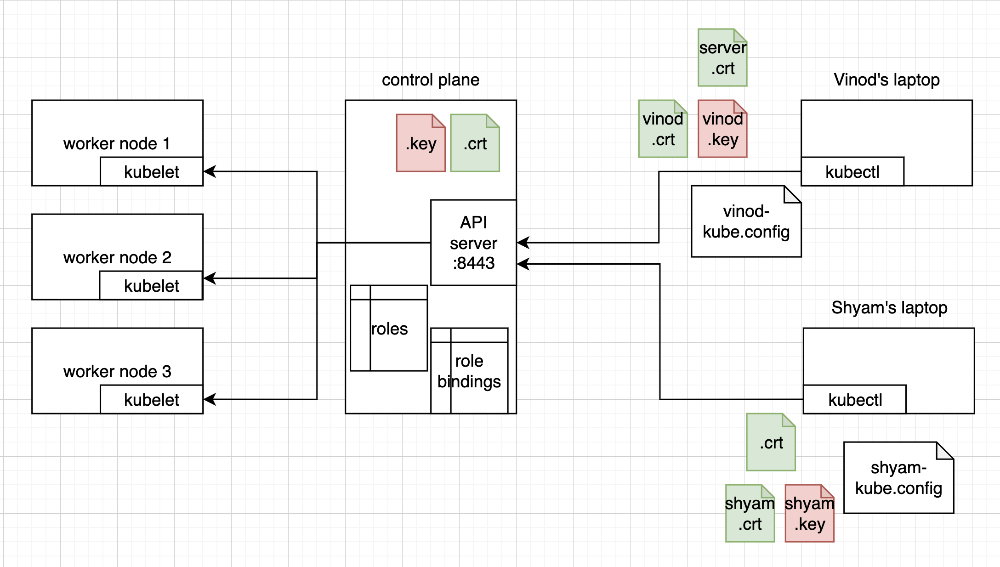

# Kubernetes RBAC (Role-Based Access Control)

## Table of Contents

1. [Introduction to RBAC](#introduction-to-rbac)
2. [RBAC Components](#rbac-components)
3. [Setting Up RBAC](#setting-up-rbac)
4. [Practical Examples](#practical-examples)
5. [Best Practices](#best-practices)
6. [Troubleshooting](#troubleshooting)

## Introduction to RBAC

Role-Based Access Control (RBAC) is a security mechanism in Kubernetes that regulates access to cluster resources based on the roles assigned to users, service accounts, or groups. RBAC allows you to define fine-grained permissions and implement the principle of least privilege.

### Why Use RBAC?

- **Security**: Limit access to only necessary resources
- **Compliance**: Meet organizational security requirements
- **Multi-tenancy**: Safely share clusters between teams
- **Audit**: Track who can perform what actions

## RBAC Components

RBAC in Kubernetes consists of four main components:

### 1. Subjects

Who is requesting access:

- **Users**: Human users (managed externally)
- **Groups**: Collections of users
- **Service Accounts**: Pod identities within the cluster

### 2. Resources

What can be accessed:

- Kubernetes objects (pods, services, deployments, etc.)
- API endpoints
- Non-resource URLs

### 3. Verbs

What actions can be performed:

- `get`, `list`, `watch`
- `create`, `update`, `patch`, `delete`
- `deletecollection`
- Custom verbs for specific resources

### 4. RBAC Objects

#### Role and ClusterRole

Define permissions (what can be done):

```yaml
# Role - namespace-scoped
apiVersion: rbac.authorization.k8s.io/v1
kind: Role
metadata:
  namespace: default
  name: pod-reader
rules:
  - apiGroups: ['']
    resources: ['pods']
    verbs: ['get', 'watch', 'list']

# ClusterRole - cluster-scoped
apiVersion: rbac.authorization.k8s.io/v1
kind: ClusterRole
metadata:
  name: secret-reader
rules:
  - apiGroups: ['']
    resources: ['secrets']
    verbs: ['get', 'list']
```

The empty string `""` in `apiGroups` has a specific and important meaning in Kubernetes RBAC. Read more here [Api Groups](./api-groups.md)

#### RoleBinding and ClusterRoleBinding

Bind roles to subjects (who can do it):

```yaml
# RoleBinding - binds Role to subjects in a namespace
apiVersion: rbac.authorization.k8s.io/v1
kind: RoleBinding
metadata:
  name: read-pods
  namespace: default
subjects:
  - kind: User
    name: jane
    apiGroup: rbac.authorization.k8s.io
roleRef:
  kind: Role
  name: pod-reader
  apiGroup: rbac.authorization.k8s.io

# ClusterRoleBinding - binds ClusterRole to subjects cluster-wide
apiVersion: rbac.authorization.k8s.io/v1
kind: ClusterRoleBinding
metadata:
  name: read-secrets-global
subjects:
  - kind: User
    name: dave
    apiGroup: rbac.authorization.k8s.io
roleRef:
  kind: ClusterRole
  name: secret-reader
  apiGroup: rbac.authorization.k8s.io
```

# Kubernetes RBAC Tutorial: Create and Manage Multiple Users with Namespaced Roles

Role-Based Access Control (RBAC) in Kubernetes is an essential mechanism to restrict or allow user access based on defined roles. In this comprehensive tutorial, we will demonstrate how to:

- Create two distinct users (`vinod` and `shyam`)
- Assign different roles to each
- Allow them access to specific Kubernetes resources within different namespaces

## Prerequisites

Ensure you have the following ready:

- A running Kubernetes cluster (e.g., Minikube)
- Access to the Kubernetes control plane (for CA files)
- `kubectl` and `openssl` installed



## Step 1: Create Users and Certificates

We'll create TLS certificates for both `vinod` and `shyam`.

### 1.1 Generate Keys and CSRs

```bash
# For vinod
openssl genrsa -out vinod.key 2048
openssl req -new -key vinod.key -out vinod.csr -subj "/CN=vinod/O=team-a"

# For shyam
openssl genrsa -out shyam.key 2048
openssl req -new -key shyam.key -out shyam.csr -subj "/CN=shyam/O=team-b"
```

### 1.2 Sign the Certificates with Kubernetes CA

```bash
# Copy these from your Minikube control plane
minikube ssh -- sudo cat /var/lib/minikube/certs/ca.crt > ca.crt
minikube ssh -- sudo cat /var/lib/minikube/certs/ca.key > ca.key

openssl x509 -req -in vinod.csr -CA ca.crt -CAkey ca.key -CAcreateserial \
-out vinod.crt -days 365

openssl x509 -req -in shyam.csr -CA ca.crt -CAkey ca.key -CAcreateserial \
-out shyam.crt -days 365
```

## Step 2: Create Kubeconfig Files

Create separate kubeconfig files for each user.

```yaml
# vinod.kubeconfig.yaml
apiVersion: v1
kind: Config
clusters:
  - name: minikube
    cluster:
      server: https://127.0.0.1:8443
      certificate-authority: ./ca.crt
users:
  - name: vinod
    user:
      client-certificate: ./vinod.crt
      client-key: ./vinod.key
contexts:
  - name: vinod-context
    context:
      cluster: minikube
      user: vinod
      namespace: dev
current-context: vinod-context
```

```yaml
# shyam.kubeconfig.yaml
apiVersion: v1
kind: Config
clusters:
  - name: minikube
    cluster:
      server: https://127.0.0.1:8443
      certificate-authority: ./ca.crt
users:
  - name: shyam
    user:
      client-certificate: ./shyam.crt
      client-key: ./shyam.key
contexts:
  - name: shyam-context
    context:
      cluster: minikube
      user: shyam
      namespace: prod
current-context: shyam-context
```

## Step 3: Define Namespaces

```bash
kubectl create namespace dev
kubectl create namespace prod
```

## Step 4: Define Roles and Bindings

### 4.1 Role for `vinod` (Pod Reader in `dev` namespace)

```yaml
# dev-pod-reader-role.yaml
apiVersion: rbac.authorization.k8s.io/v1
kind: Role
metadata:
  namespace: dev
  name: dev-pod-reader
rules:
  - apiGroups: ['']
    resources: ['pods']
    verbs: ['get', 'list', 'watch']
```

```yaml
# dev-pod-reader-binding.yaml
apiVersion: rbac.authorization.k8s.io/v1
kind: RoleBinding
metadata:
  name: vinod-pod-reader-binding
  namespace: dev
subjects:
  - kind: User
    name: vinod
    apiGroup: rbac.authorization.k8s.io
roleRef:
  kind: Role
  name: dev-pod-reader
  apiGroup: rbac.authorization.k8s.io
```

### 4.2 Role for `shyam` (Deployment Manager in `prod` namespace)

```yaml
# prod-deployment-manager-role.yaml
apiVersion: rbac.authorization.k8s.io/v1
kind: Role
metadata:
  namespace: prod
  name: prod-deployment-manager
rules:
  - apiGroups: ['apps']
    resources: ['deployments']
    verbs: ['create', 'update', 'delete', 'get', 'list']
```

```yaml
# prod-deployment-binding.yaml
apiVersion: rbac.authorization.k8s.io/v1
kind: RoleBinding
metadata:
  name: shyam-deployment-binding
  namespace: prod
subjects:
  - kind: User
    name: shyam
    apiGroup: rbac.authorization.k8s.io
roleRef:
  kind: Role
  name: prod-deployment-manager
  apiGroup: rbac.authorization.k8s.io
```

Apply all the YAML files:

```bash
kubectl apply -f dev-pod-reader-role.yaml
kubectl apply -f dev-pod-reader-binding.yaml
kubectl apply -f prod-deployment-manager-role.yaml
kubectl apply -f prod-deployment-binding.yaml
```

## Step 5: Test User Access

### Switch to `vinod` kubeconfig

```bash
export KUBECONFIG=./vinod.kubeconfig.yaml
kubectl get pods -n dev     # ✅ Allowed
kubectl get deployments -n dev  # ❌ Forbidden
```

### Switch to `shyam` kubeconfig

```bash
export KUBECONFIG=./shyam.kubeconfig.yaml
kubectl get deployments -n prod  # ✅ Allowed
kubectl get pods -n prod         # ❌ Forbidden
```

## Conclusion

RBAC is essential for securing Kubernetes clusters and implementing proper access controls. Start with restrictive permissions and gradually expand as needed. Regular auditing and following the principle of least privilege will help maintain a secure environment.

Remember to test your RBAC configurations thoroughly before deploying to production, and always maintain proper documentation of your permission structure for easier management and auditing.

With Kubernetes RBAC, you can create fine-grained access controls tailored to specific users and namespaces. In this tutorial, we:

- Created certificates for `vinod` and `shyam`
- Created kubeconfigs for each user
- Defined roles specific to namespaces and resources
- Validated access restrictions using `kubectl`

This setup is scalable for larger teams and more complex policies using RoleBindings and ClusterRoles.
